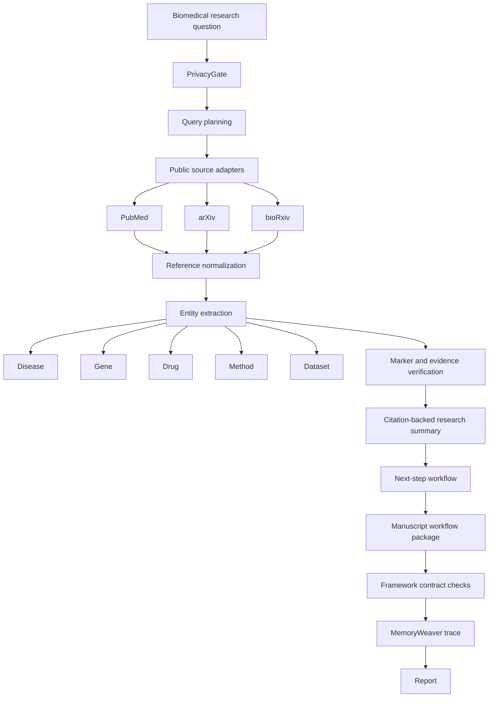

# End-to-End Biomedical Research Workflow

This document organizes the full public-safe BioResearch-Agent workflow from a biomedical research question to a reviewable report.

The design goal is:

```text
biomedical question
  -> public literature retrieval
  -> entity and evidence extraction
  -> citation-backed research summary
  -> next-step workflow
  -> manuscript workflow package
  -> MemoryWeaver trace
  -> report
```

BioResearch-Agent must keep this workflow public-safe: no private patient data, private project code, internal service routes, model paths, logs, credentials, or proprietary tool manifests.

## Framework Reference Policy

Implementation should learn from mature public frameworks and existing project experience, but stay clean-room:

- Use public academic-writing skill projects for reusable workflow patterns: skill-pack layering, strategist/composer split, IMRAD contracts, audit gates, and reviewer-response loops.
- Use `D:\Download\PathoFlow` only as a high-level framework reference for layered boundaries, contracts, provenance, execution gates, observability, benchmarks, and failure-path recording.
- Do not copy PathoFlow source code, private data, logs, `.env`, runtime manifests, service routes, deployment paths, WISH/Pinglab assets, or generated reports.
- If a PathoFlow-like pattern is adopted, express it as a small BioResearch-Agent-native contract, dataclass, test, or document rule.

External skill packs can be mounted directly through `SKILL.md` discovery:

```powershell
python -m bioresearch_agent --skill-pack github:aipoch/medical-research-skills --list-external-skills
python -m bioresearch_agent --skill-pack github:aipoch/medical-research-skills --langgraph-node-specs --json
```

This treats external skills as routing and operating contracts. It does not vendor their code or copy their writing instructions into generated biomedical reports.

## One-Line Flow

```text
Input question
  -> search PubMed / arXiv / bioRxiv
  -> extract disease / gene / drug / method / dataset
  -> generate cited research summary
  -> generate next-step workflow
  -> generate manuscript strategy, IMRAD outline, and quality gates
  -> MemoryWeaver records success paths, failure paths, and evidence sources
  -> output report
```

## System Flow



## Stage Contract

| Stage | Input | Output | Public-safe rule |
| --- | --- | --- | --- |
| `PrivacyGate` | User research question and optional notes | Approved or blocked request | Block secrets, private paths, patient-like IDs, heavy private files, and internal markers. |
| Query planning | Approved question | Search terms, inclusion hints, exclusion hints | Do not infer clinical advice or private context. |
| Public retrieval | Search terms | Normalized references from PubMed, arXiv, and bioRxiv | Use only public metadata or public full text where allowed. |
| Reference normalization | Source-specific records | Common paper schema | Preserve source, URL/ID, title, abstract, authors, year, venue, and DOI when available. |
| Entity extraction | Paper title, abstract, tags, metadata | Disease/gene/drug/method/dataset mentions with provenance | Extract only from visible public metadata unless full text is explicitly public and allowed. |
| Marker verification | References and extracted entities | Evidence-backed neutral markers | Markers are grouping labels, not quality scores. |
| Research summary | Verified evidence records | Summary with citations | Every substantive claim should cite supporting references. |
| Next-step workflow | Summary, gaps, conflicts, extracted entities | Reviewable research plan | Produce actions for human review, not clinical decisions. |
| Manuscript workflow package | Summary, references, entities, gaps, marker checks | Strategist/composer steps, IMRAD outline, narrative checks, audit gates, reviewer-response plan | Produce writing scaffolds only; do not fabricate results, citations, or submission claims. |
| Framework contract checks | Workflow outputs and trace | Stage checks for required outputs, missing evidence, and failure strategy | Encode mature-framework lessons as small public-safe checks, not copied framework code. |
| MemoryWeaver | Run events, decisions, failures, evidence | Reusable public-safe trace | Store evidence IDs, paths taken, skipped paths, warnings, and rationale; do not store private data. |
| Report | Summary, workflow, MemoryWeaver trace | Markdown or JSON report | Include caveats, evidence limits, and human-review requirement. |

## Reference Schema

Each retrieved paper should be normalized before downstream processing.

```python
ReferenceRecord = {
    "reference_id": "stable public-safe id",
    "source": "pubmed | arxiv | biorxiv | placeholder",
    "source_id": "PMID, arXiv id, DOI, or preprint id",
    "title": "public title",
    "abstract": "public abstract",
    "authors": ["public author names when available"],
    "year": 2026,
    "venue": "journal, conference, or preprint server",
    "doi": "optional DOI",
    "url": "public source URL",
    "retrieved_at": "ISO-8601 timestamp",
}
```

## Entity Extraction Schema

Entity extraction should stay transparent and reviewable. A mention is useful only if the report can show where it came from.

```python
EntityMention = {
    "entity_type": "disease | gene | drug | method | dataset",
    "text": "surface form from title, abstract, tags, or allowed public full text",
    "normalized_name": "optional normalized public name",
    "reference_id": "source ReferenceRecord id",
    "evidence_field": "title | abstract | tag | public_full_text",
    "confidence": "low | medium | high",
}
```

Recommended starting extractors:

- Dictionary or pattern-based extraction for public-safe demos.
- Optional public ontology adapters later, such as MeSH for diseases or public gene symbol tables.
- No private biomedical datasets or internal annotation systems.

## Citation-Backed Summary Shape

The research summary should be answer-first, but every claim needs visible evidence.

```markdown
# Research Summary

## Short Answer

...

## Key Evidence

- Claim ... [PMID:..., arXiv:..., DOI:...]
- Claim ... [bioRxiv:..., DOI:...]

## Extracted Entities

| Type | Entity | Evidence | References |
| --- | --- | --- | --- |

## Gaps And Conflicts

...

## Caveats

- Literature metadata support does not prove clinical validity.
- Human review is required before research or clinical use.
```

## Next-Step Workflow Shape

The workflow should convert the summary into bounded next actions.

```text
1. Refine question and scope.
2. Expand search terms from extracted entities.
3. Group papers by neutral marker.
4. Verify whether each marker is supported by public metadata.
5. Compare same-marker papers for shared assumptions and differences.
6. Identify missing evidence or weakly supported claims.
7. Generate a human-review checklist.
8. Export the report.
```

## Manuscript Workflow Package

The manuscript package adapts mature public academic-writing skill patterns into BioResearch-Agent's privacy-safe boundary:

| Borrowed pattern | BioResearch-Agent version |
| --- | --- |
| Skill-pack layering | Keep retrieval, evidence extraction, writing, QA, and response planning as separate reviewable stages. |
| Strategist/composer split | Plan contribution, audience, gap, and outline before writing section-level prose. |
| IMRAD section contracts | Give each section a purpose, evidence inputs, and quality gate. |
| Nature-family / top-journal restraint | Use evidence-first narrative discipline without copying article language or pretending to match a journal. |
| Paper-audit workflow | Check claim-citation support, evidence strength, figure/table messages, reproducibility, and privacy. |
| Reviewer-response workflow | Map reviewer point -> action -> changed location -> evidence ID -> unresolved risk. |

The generated package contains:

```text
1. Manuscript strategy
2. Composer steps
3. IMRAD outline
4. Narrative checks
5. Claim-citation and figure/table audit gates
6. Reviewer response plan
```

It must not:

- invent experiments, datasets, metrics, p-values, references, DOI values, or reviewer outcomes;
- rewrite public evidence as clinical advice;
- imitate copyrighted article prose;
- remove caveats needed for biomedical safety.

### Public Projects Used As Design References

These projects informed the workflow structure. BioResearch-Agent does not copy their implementation code, private prompts, or article prose.

| Public project | Pattern learned |
| --- | --- |
| [AcademicForge](https://github.com/HughYau/AcademicForge) | Curated academic skill packs work better than one giant all-purpose prompt. |
| [medical-research-skills](https://github.com/aipoch/medical-research-skills) | Biomedical research workflows should be grouped by evidence discovery, protocol design, analysis, writing, and publication readiness. |
| [codex-claude-academic-skills](https://github.com/zLanqing/codex-claude-academic-skills) | Writing, office documents, and scientific computation are complementary stages, not one blended task. |
| [academic-paper-skills](https://github.com/lishix520/academic-paper-skills) | Strategist/composer separation keeps planning, evidence gaps, outline validation, drafting, and polishing reviewable. |
| [nature-writing-skill](https://github.com/SyntaxSmith/nature-writing-skill) | A slim routing index plus targeted references is safer than loading a full writing manual at once. |
| [academic-writing-skills](https://github.com/bahayonghang/academic-writing-skills) | Post-writing QA should separate format checks, citation integrity, reviewer-style audit, and source-preserving edits. |

## MemoryWeaver Trace

MemoryWeaver is the public-safe run memory layer for this workflow. It records what happened, why it happened, and what evidence supported it.

It should record:

| Trace item | Meaning |
| --- | --- |
| `question` | Sanitized biomedical research question. |
| `query_plan` | Search terms, source choices, inclusion/exclusion hints. |
| `success_paths` | Retrieval, extraction, marker, or summary steps that produced useful evidence. |
| `failure_paths` | Empty searches, blocked private inputs, unsupported claims, missing metadata, or extractor misses. |
| `evidence_sources` | Public reference IDs, URLs, DOIs, PMIDs, arXiv IDs, bioRxiv IDs. |
| `decision_rationale` | Why the workflow expanded, skipped, or flagged a path. |
| `warnings` | Privacy, evidence quality, unsupported claim, or human-review warnings. |

Example trace shape:

```python
MemoryWeaverTrace = {
    "run_id": "public-safe run id",
    "question": "sanitized research question",
    "query_plan": {
        "sources": ["pubmed", "arxiv", "biorxiv"],
        "queries": ["biomedical agent evidence retrieval", "..."],
    },
    "success_paths": [
        {
            "stage": "pubmed_retrieval",
            "result": "found public metadata records",
            "evidence_ids": ["PMID:..."],
        }
    ],
    "failure_paths": [
        {
            "stage": "entity_extraction",
            "result": "no dataset entity found in visible metadata",
            "next_action": "expand query with dataset-related terms",
        }
    ],
    "evidence_sources": [
        {"reference_id": "PMID:...", "source": "pubmed", "url": "https://..."}
    ],
    "warnings": ["Human review required for biomedical claims."],
}
```

MemoryWeaver must not store:

- Private uploaded data.
- Patient identifiers.
- Local absolute paths.
- API keys or tokens.
- Internal routes, logs, model paths, or proprietary tool payloads.

## Report Sections

The final report should be concise and auditable.

```text
1. Research question
2. Search scope and sources
3. Key findings with citations
4. Extracted disease / gene / drug / method / dataset table
5. Neutral markers and verification status
6. Same-marker comparison
7. Evidence gaps and failed paths
8. Recommended next-step workflow
9. Manuscript workflow package
10. MemoryWeaver trace summary
11. Caveats and human-review checklist
```

For external skill-pack mounting and LangGraph handoff details, see [skill_pack_integration.md](skill_pack_integration.md).

## Current Implementation Versus Extension Target

| Capability | Current state | Extension target |
| --- | --- | --- |
| Privacy gate | Implemented in `bioresearch_agent/privacy.py` | Keep as first gate for every source adapter and report export. |
| Retrieval | Local public placeholder corpus in `bioresearch_agent/retrieval.py`; optional live PubMed, arXiv, and bioRxiv metadata adapters in `bioresearch_agent/live_sources.py` | Add richer ranking, retries, pagination, and public ontology enrichment. |
| Markers | Implemented as neutral reference markers | Extend marker provenance to include extracted entity evidence. |
| Entity extraction | Dictionary/pattern extraction for disease/gene/drug/method/dataset with provenance. | Add public ontology-backed extraction and synonym expansion. |
| Citation summary | End-to-end report generator cites reference IDs, DOI/URL/source IDs when available, and marker support. | Add full-text-public extraction when licenses allow. |
| Next-step workflow | Generated from extracted entities, neutral markers, and source mode. | Add gap/conflict ranking and persistent task export. |
| Manuscript workflow | Strategy, IMRAD outline, narrative checks, audit gates, and reviewer-response plan are generated in the end-to-end report. | Add source-backed section drafting and manuscript file export with citation integrity checks. |
| MemoryWeaver | Trace dataclass records success paths, failure paths, evidence sources, query plan, and warnings. | Add persistent trace export and run-to-run learning. |
| Report | Full Markdown/JSON report includes evidence, entities, marker checks, next workflow, manuscript package, trace, caveats, and live-source provenance when enabled. | Add optional file export. |
| Benchmark | `python -m bioresearch_agent --benchmark` runs three independent workflow cases over placeholder or live adapters. | Add stored benchmark artifacts, historical trend comparison, and stricter entity recall metrics. |

## Minimal Implementation Roadmap

1. Add `ReferenceRecord`, `EntityMention`, and `MemoryWeaverTrace` dataclasses.
2. Add source adapter interfaces for PubMed, arXiv, and bioRxiv.
3. Keep placeholder adapters for tests, then add public adapters one at a time.
4. Add entity extraction over title, abstract, tags, and allowed public full text.
5. Add citation-backed summary generation from verified evidence.
6. Add next-step workflow generation from evidence gaps and entity groups.
7. Add manuscript workflow package generation from mature public academic-writing patterns.
8. Add MemoryWeaver trace capture for success paths, failure paths, and evidence sources.
9. Add framework contract checks for stage outputs and traceability.
10. Add report export tests and CLI flags.

## Validation Expectations

Run the complete placeholder workflow:

```powershell
python -m bioresearch_agent "How do BRCA1 breast cancer papers connect drugs, datasets, and RAG methods?" --end-to-end-report
```

Run the complete live public-metadata workflow:

```powershell
python -m bioresearch_agent "BRCA1 breast cancer PARP inhibitor datasets RAG" --end-to-end-report --live-sources
```

Run the independent workflow benchmark:

```powershell
python -m bioresearch_agent --benchmark
python -m bioresearch_agent --benchmark --live-sources
```

Before publishing changes to this workflow, run:

```powershell
python -m pytest -q
python -m bioresearch_agent --list-skills
python -m bioresearch_agent --list-tools
```

Before a public release, also run the privacy scan described in [CODEX.md](../CODEX.md).
